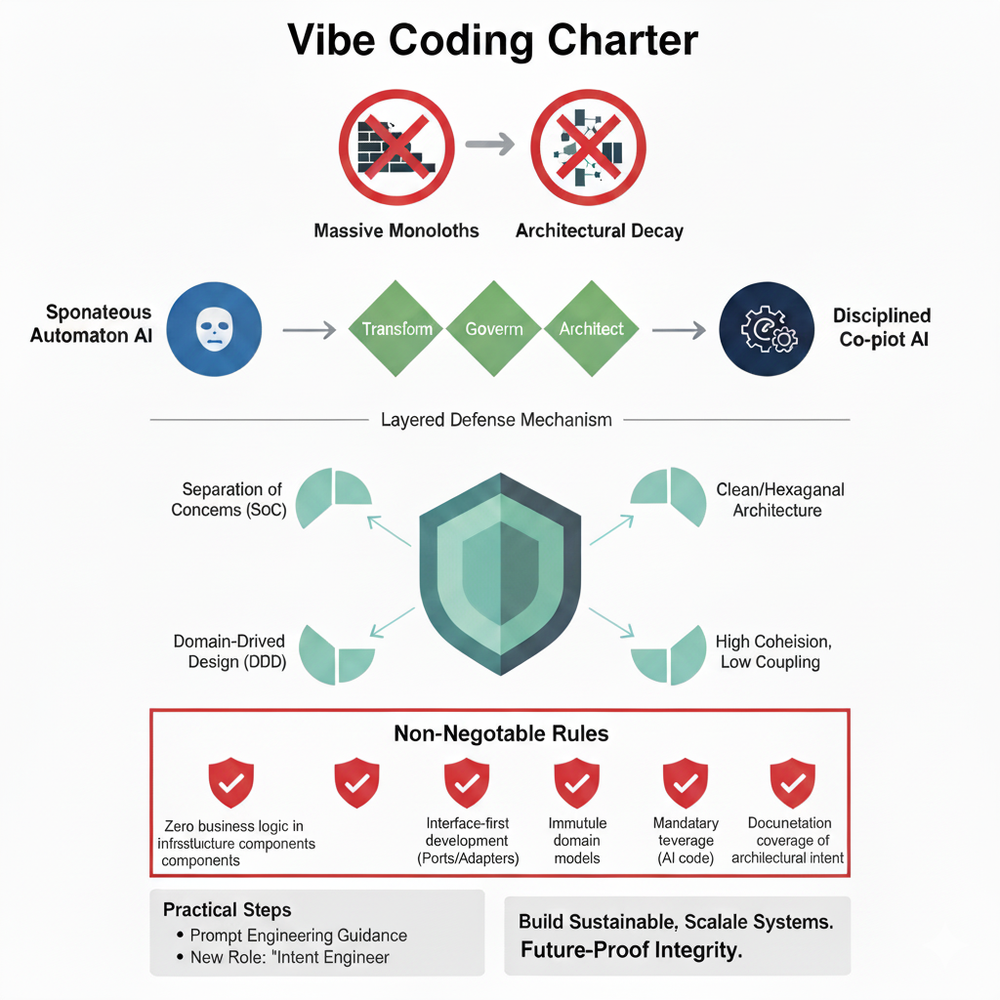

# Vibe Coding Charter
## A New Standard for AI-Augmented Development

### Transforming AI from a spontaneous automaton into a disciplined, architecture-aware co-pilot

---

## 🚀 The Challenge

The rapid adoption of AI-assisted coding is creating a new challenge for software architects: **how do we harness AI's speed without sacrificing long-term architectural integrity?**

Unconstrained "vibe coding" can lead to:
- ❌ Architectural decay
- ❌ Exponential technical debt
- ❌ Massive monoliths
- ❌ Organizational friction

## 🎯 The Solution: The Vibe Coding Charter

A comprehensive governance framework designed to transform AI from a spontaneous automaton into a **disciplined, architecture-aware co-pilot**.

### 🏗️ Four Core Architectural Principles

1. **Separation of Concerns (SoC)**
2. **Domain-Driven Design (DDD)**
3. **Clean/Hexagonal Architecture**
4. **High Cohesion, Low Coupling**

### 🛡️ Five Non-Negotiable Rules

1. **Zero business logic in infrastructure components**
2. **Interface-first development using the Ports and Adapters pattern**
3. **Immutable domain models to reduce complexity**
4. **Mandatory testing coverage for all AI-generated code**
5. **Documentation of architectural intent to prevent context drift**

## 📋 Key Features

- **Layered Defense Mechanism**: Institutionalizes architectural discipline
- **Prevents Abstraction Gap**: Ensures proper layering and modularity
- **Advanced Prompt Engineering**: Guides AI toward sustainable code generation
- **Intent Engineer Role**: New specialist role for architectural governance
- **Practical Implementation Steps**: Actionable guidance for teams

## 🎯 Benefits

✅ **Speed + Integrity**: Harness AI velocity without sacrificing quality
✅ **Prevent Technical Debt**: Stop architectural decay before it starts
✅ **Scalable Systems**: Build for the future without sacrificing integrity
✅ **Team Alignment**: Clear standards for AI-augmented development
✅ **Organizational Agility**: Loose coupling enables independent teams

## 📚 Documentation

This repository contains:

- **[Charter Document](Vibe%20Coding%20Charter.pdf)**: Complete framework and implementation guide
- **[Research Paper](Vibe%20Coding,%20SoC,%20and%20Monoliths.pdf)**: In-depth analysis of architectural decay in AI-augmented development
- **[SKILL.md](SKILL.md)**: Architectural principles and code generation standards (original)
- **[skill2026.md](skill2026.md)**: **2026 Edition** — updated standards reflecting the current AI-augmented development landscape
- **Implementation Examples** (Coming Soon)
- **Templates and Checklists** (Coming Soon)

### 🆕 What's New in SKILL.md 2026 Edition

The 2026 edition extends the foundational patterns with significant updates to reflect the reality that most production code is now co-authored with AI:

#### Expanded Principles & Rules
- **6 Core Principles** (up from 4): Added **MCP-Native Integration Architecture** and **Parallelism-First Design** as new architectural pillars
- **7 Non-Negotiable Rules** (up from 5): Added **MCP-Compliant Service Boundaries** (one MCP server per bounded context, tools for writes, resources for reads) and **Parallel-Safe Orchestration** (DAG-based workflow execution)

#### New Pattern Sections
- **MCP Integration Patterns**: Bounded contexts as MCP servers, MCP client adapters behind ports, and centralized server registry configuration
- **Parallelization Patterns**: Fan-out/fan-in, pipeline parallelism with typed stages, and agent task decomposition
- **AI-Native Context Patterns**: Structured output schemas with Pydantic, context window management, and persistent memory via MCP resources
- **Multi-Agent Coordination**: Patterns for decomposing complex tasks across parallel AI agents with research, synthesis, and validation phases
- **Advanced Patterns**: Event-driven communication with MCP-backed event bus, CQRS with separate read/write MCP interfaces

#### Practical Guidance
- **Implementation Checklist**: Layer-by-layer verification checklist covering layer separation, interface design, domain modeling, MCP compliance, parallelization, testing, and documentation
- **Code Generation Guidelines**: Step-by-step workflow — start with the domain, define ports, implement use cases, add infrastructure adapters, create tests at every layer
- **Updated Project Structure**: Includes `mcp_servers/`, `mcp_clients/`, and `orchestration/` directories
- **Certification Criteria**: 8-point quality gate including architectural fitness functions, test coverage thresholds (≥80% overall, ≥95% domain), and MCP compliance
- **Expanded Anti-Patterns**: New warnings against MCP sprawl, synchronous bottlenecks, god orchestrators, untyped AI output, and context stuffing

> **Note**: All patterns should be applied pragmatically based on project scale — a solo microservice doesn't need multi-agent coordination, but it still needs clean layer separation and tests.

## 🤝 Contributing

We believe the future of software development requires disciplined AI collaboration. **Your contributions can help shape the industry standard for AI-augmented development.**

### How to Contribute

1. **Share Your Experience**: Add case studies of successful charter implementation
2. **Extend the Framework**: Propose additional rules or principles
3. **Create Tools**: Build automation to enforce charter principles
4. **Improve Documentation**: Help make the charter more accessible
5. **Translate**: Make the charter available in more languages

### Contribution Areas

- 📖 **Documentation improvements**
- 🛠️ **Tool development** (linters, CI/CD plugins, IDE extensions)
- 📊 **Case studies and examples**
- 🧪 **Testing frameworks** for charter compliance
- 🎯 **Industry-specific adaptations**
- 📝 **Educational content** and workshops

## 🏃‍♂️ Quick Start

1. **Read the Charter**: Start with the [main document](Vibe%20Coding%20Charter.pdf)
2. **Assess Your Current State**: Evaluate existing AI-generated code
3. **Implement Boundaries**: Define Domain-Driven Design contexts
4. **Establish Governance**: Create your Technical Steering Committee
5. **Train Your Team**: Introduce the Intent Engineer role
6. **Measure and Improve**: Track architectural debt metrics

## 📖 Key Concepts

### The Velocity/Integrity Paradox
The fundamental conflict between optimizing for speed versus architectural integrity in AI-augmented development.

### The Abstraction Gap
When AI skips essential architectural layers, creating tightly coupled, monolithic code.

### Intent Engineer
A new role focusing on defining, communicating, and enforcing architectural constraints for AI systems.

### Massive Monolith
The inevitable result of unconstrained AI coding - a tightly coupled system resistant to change.

## 🌟 Vision

**Build for the future without sacrificing integrity.**

This charter is not about limiting AI - it's about creating a layered defense mechanism that institutionalizes architectural discipline, prevents the abstraction gap, and ensures organizations can leverage AI to build sustainable, scalable systems.

---

## 📞 Get Involved

- 🐛 **Report Issues**: Found a problem? [Open an issue](https://github.com/asmeyatsky/vibecharter/issues)
- 💡 **Request Features**: Have an idea? [Start a discussion](https://github.com/asmeyatsky/vibecharter/discussions)
- 🔄 **Submit PRs**: Ready to contribute? [Create a pull request](https://github.com/asmeyatsky/vibecharter/pulls)
- 🗣️ **Join the Conversation**: Share your experiences with the charter

## 💝 Sponsorship

Support the future of disciplined AI-augmented development! Your sponsorship helps maintain this framework and enables continued research into architectural governance for AI systems.

- 💖 **[Become a Sponsor](https://github.com/sponsors/asmeyatsky)**: Support ongoing development and maintenance

## 📄 License

This project is licensed under the MIT License - see the [LICENSE](LICENSE) file for details.

---

### 🚀 Let's build the future of AI-augmented development together!

*The speed of AI + The discipline of architecture = Sustainable software systems*
